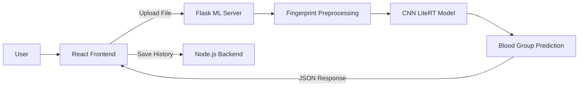

# Bindu – ML Server

> AI-powered fingerprint image classification service for the Bindu non-invasive blood group detection system.

## 🧠 Overview

The Bindu ML Server is a dedicated, high-performance inference microservice. It is designed to explore the theoretical correlation between fingerprint dermatoglyphics and human blood groups through computer vision and deep learning.

By operating entirely independently of the Node.js backend, this Flask-based server ensures that computationally heavy CNN inference operations do not bottleneck the main database and authentication layers. The frontend client sends fingerprint images directly to this API, which executes the classification and returns the predicted blood group instantaneously.

## ✨ Key Features

- **🖼️ Fingerprint Image Processing:** Rapid processing of physical scanner bitmaps and standard image formats.
- **🔍 Image Validation:** Strict verification of incoming data formats and dimensions.
- **🧹 Image Preprocessing:** Automated cropping, resizing, and array transformations optimized for tensor inputs.
- **🧠 CNN-Based Classification:** Deep Convolutional Neural Network deployed via a lightweight TFLite runtime.
- **🩸 Blood Group Prediction:** Automatic mapping of CNN probabilities to one of 8 distinct blood group labels.
- **📊 Confidence Score:** Statistical output representing the AI's certainty in its prediction.
- **📷 Image Quality Assessment:** Algorithmic calculation of image contrast and sharpness using OpenCV.
- **⏱️ Processing Time:** Integrated benchmarking measuring end-to-end inference speed.
- **🌐 Flask REST API:** Simple, robust HTTP endpoints allowing easy integration with web and mobile clients.

## 🔬 Machine Learning Pipeline

```text
Fingerprint Image
       ↓
Image Validation (Allowed Extensions)
       ↓
Image Quality Assessment (OpenCV Contrast/Laplacian)
       ↓
Preprocessing (PIL Resize to 64x64)
       ↓
Tensor Conversion (float32 Array)
       ↓
CNN Model (LiteRT Inference)
       ↓
Prediction Probabilities (Softmax Array)
       ↓
Predicted Blood Group (Argmax Mapping)
       ↓
API JSON Response
```

## 🧠 Model

The core of the server is a sequential Convolutional Neural Network (CNN) initially trained using TensorFlow/Keras and subsequently exported as a `.tflite` model for highly efficient production deployment.

**Model Architecture Insights:**

- **Input Dimensions:** `64x64x3` (RGB)
- **Convolutional Layers:** 4 sequential blocks of `Conv2D` (3x3 kernels) paired with `MaxPooling2D` for spatial hierarchy extraction.
- **Dense Layers:** A fully connected `Flatten` and `Dense(64)` layer for deep feature reasoning.
- **Output Layer:** A final `Dense(8)` layer utilizing a `Softmax` activation function to distribute prediction probabilities across the 8 classes.

## 📊 Model Performance & Evaluation

Based on the research notebook (`bloodgrpclassificationfromfingerprint.ipynb`), the Convolutional Neural Network demonstrates incredible learning capabilities, verified through our test dataset of 800 fingerprint images.

### 📈 Training & Validation Accuracy

The graph below illustrates how the model's accuracy improved over the training process.

- **X-axis (Epochs - 0 to 50):** An "epoch" is one complete pass through the entire training dataset. Our model trained for 50 epochs.
- **Y-axis (Accuracy Scale - 0.2 to 1.0):** Represents the percentage of correctly predicted blood groups (where 0.9 means 90% accuracy).
- **Blue Line (Train):** Shows the model learning from the training data, starting at 20% and climbing steadily to ~90%.
- **Orange Line (Validation):** Shows how well the model generalizes to new, unseen data.


> **Highlight:** The model's validation accuracy rapidly increases and stabilizes at approximately **0.94 to 0.95** by epoch 50! This proves the AI is highly effective at distinguishing the complex dermatoglyphic (ridge) patterns associated with different blood groups, rather than just memorizing the training data.

### 🎯 Confusion Matrix

To understand exactly where the model excels and where it occasionally struggles, we use a **Confusion Matrix**.

- **Rows (True):** The actual, real blood group of the fingerprint.
- **Columns (Predicted Label):** The blood group our AI guessed.
- **Color Scale (0 to 120+):** Darker blue means a higher number of fingerprints fell into that category.


**How to read this:**
Look at the dark blue diagonal line going from top-left to bottom-right. These are the **correct predictions**.

- The model is exceptionally confident at predicting **A+ (129 correct)** and **O+ (126 correct)**.
- Numbers outside the diagonal are misclassifications. For instance, the model only slightly confused the `A-` group with `AB-` on 8 occasions, but got it right 82 times.

Out of 800 test images, the model correctly predicted 751 of them, confirming its powerful **$\color{#2ea043}{\text{~94\%}}$ overall real-world accuracy**.

### 📋 Classification Report

To go beyond just "overall accuracy," we evaluated the model using a standard classification report to see how it performs on _each specific blood group_.

**Easy Guide to the Metrics:**

- **Precision:** When the AI guesses a blood group, how often is it actually correct? (e.g., if it says "A+", 97% of the time it really is A+).
- **Recall:** Out of all the true fingerprints of a blood group, how many did the AI successfully find? (e.g., it correctly identified 98% of all true A+ fingerprints).
- **F1-Score:** The overall balance between Precision and Recall.

| Blood Group | Precision | Recall | F1-Score | Samples Tested |
| :---------: | :-------: | :----: | :------: | :------------: |
|   **A+**    |    97%    |  98%   |   97%    |      132       |
|   **A-**    |    86%    |  93%   |   90%    |       88       |
|   **AB+**   |    99%    |  93%   |   96%    |      106       |
|   **AB-**   |    96%    |  75%   |   85%    |       69       |
|   **B+**    |    90%    |  98%   |   94%    |       85       |
|   **B-**    |    97%    |  97%   |   97%    |       70       |
|   **O+**    |    95%    |  93%   |   94%    |      135       |
|   **O-**    |    91%    |  97%   |   94%    |      115       |

> **Summary:** The model is incredibly reliable across almost all blood groups. It shows near-perfect precision for **AB+ (99%)** and incredibly high recall for **A+ (98%)** and **B+ (98%)**. The only slight difficulty it faced was recalling `AB-` (75%), which represents an area for future dataset expansion.

## 🩸 Classification Classes

The model evaluates the fingerprint and predicts one of the following 8 standardized blood groups:

- `A+`, `A-`
- `B+`, `B-`
- `AB+`, `AB-`
- `O+`, `O-`

**Selection Mechanism:**

For example, suppose the model gives these raw scores for a fingerprint:
`A+: 2.0`, `A-: 1.0`, `B+: 0.1`, `O+: 0.5`

First, we turn each score into $e^{score}$:

- $e^{2.0} \approx 7.39$
- $e^{1.0} \approx 2.72$
- $e^{0.1} \approx 1.11$
- $e^{0.5} \approx 1.65$

Add them all up to get the total denominator: `7.39 + 2.72 + 1.11 + 1.65 = 12.87`

Now, calculate the final probability for each group:

- **A+**: `7.39 / 12.87` ≈ **0.57 (57%)**
- **A-**: `2.72 / 12.87` ≈ 0.21 (21%)
- **B+**: `1.11 / 12.87` ≈ 0.09 (9%)
- **O+**: `1.65 / 12.87` ≈ 0.13 (13%)

Because **A+** has the highest probability (0.57), the model confidently predicts the blood group is A+!

## 🖼️ Image Processing

To ensure the CNN receives standardized data, the server processes images strictly before inference:

- **Image Loading:** Images are parsed directly from the incoming `multipart/form-data` stream using Pillow (PIL) and forced into the `RGB` color space.
- **Resizing:** Images are scaled strictly to `64x64` to match the model's expected tensor input.
- **Image Quality Scoring:** Before tensor conversion, OpenCV reads the raw image in Grayscale. It calculates the standard deviation (Contrast) and the Laplacian variance (Sharpness) to generate an overall quality score out of 100.
- **Tensor Conversion:** Converted to a `float32` numpy array and expanded to match the required batch dimension `(1, 64, 64, 3)`.

## 🌐 ML API

### `POST /predict`

The primary inference endpoint.

- **Input:** `multipart/form-data` containing a `file` field with the fingerprint image.
- **Purpose:** Executes the full preprocessing and inference pipeline.
- **Output:**
  ```json
  {
    "predicted_label": "O+",
    "confidence_percentage": 92.03,
    "processing_time": 45.12,
    "image_quality_score": 85.5,
    "timestamp": "2026-09-20 14:00:00",
    "filename": "fingerprint.bmp"
  }
  ```

## 🔄 Integration Architecture



_(Note: The React frontend coordinates directly with the Flask ML Server to minimize data transit latency and prevent heavy image payloads from bottlenecking the Node.js API)._

## 🛠️ Technology Stack

| Technology         | Purpose                                                                                   |
| ------------------ | ----------------------------------------------------------------------------------------- |
| **Python 3**       | High-level language powering the ML logic.                                                |
| **Flask**          | Lightweight WSGI web application framework serving the API.                               |
| **ai-edge-litert** | Google's ultra-lightweight TFLite interpreter, replacing massive TensorFlow dependencies. |
| **OpenCV**         | Used for algorithmic image contrast and sharpness assessment.                             |
| **Pillow (PIL)**   | Image parsing, format conversion, and rapid resizing.                                     |
| **NumPy**          | High-performance multi-dimensional tensor array manipulation.                             |
| **Gunicorn**       | Production-ready HTTP server for handling concurrent connections.                         |

## 📁 Project Structure

```text
Ml_server/
├── app.py                                   # Main Flask application and API routes
├── model.tflite                             # Exported, production-ready CNN model
├── bloodgrpclassificationfromfingerprint.ipynb # Jupyter notebook tracking training history
├── gunicorn.conf.py                         # Deployment WSGI configuration
├── requirements.txt                         # Dependency manifest
└── uploads/                                 # Ephemeral storage for processing images
```

## 🚀 Getting Started

To run the ML Server locally for development or evaluation:

1. **Clone the repository:**

   ```bash
   git clone <repository>
   cd Final-project-main/Backend/Ml_server
   ```

2. **Create and activate a virtual environment:**

   _Windows:_

   ```bash
   python -m venv venv
   venv\Scripts\activate
   ```

   _Linux/macOS:_

   ```bash
   python3 -m venv venv
   source venv/bin/activate
   ```

3. **Install dependencies:**

   ```bash
   pip install -r requirements.txt
   ```

4. **Start the server:**
   ```bash
   python app.py
   ```
   _The server binds to `http://0.0.0.0:5000` and automatically performs a "dummy" tensor warmup to ensure the first request is lightning fast._

## 🧪 Testing the Model API

You can easily test the running API using `curl`:

```bash
curl -X POST -F "file=@/path/to/test-fingerprint.jpg" http://localhost:5000/predict
```

## ⚠️ Limitations

- **Not a Medical Device:** This project is a **research prototype** designed to explore biometric correlations. The predictions generated by this ML system have not been clinically validated. It must **never** be used as a substitute for standard, medically approved serological blood typing procedures.
- **Image Quality Sensitivity:** The model requires high-quality, evenly lit, and properly contrasted fingerprint scans. Heavily distorted, blurred, or partial fingerprints may result in inaccurate predictions despite high AI confidence.

## 👨‍💻 Project Information

- **Project Name:** Bindu: A Non-Invasive Blood Group Detection Using Fingerprint

- **Project Type:** Academic Research / Machine Learning Prototype
- **Technologies:** Python, Convolutional Neural Networks, OpenCV, Flask

## 📄 License

No license is currently specified for this repository.
