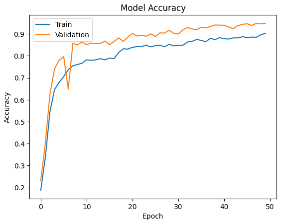
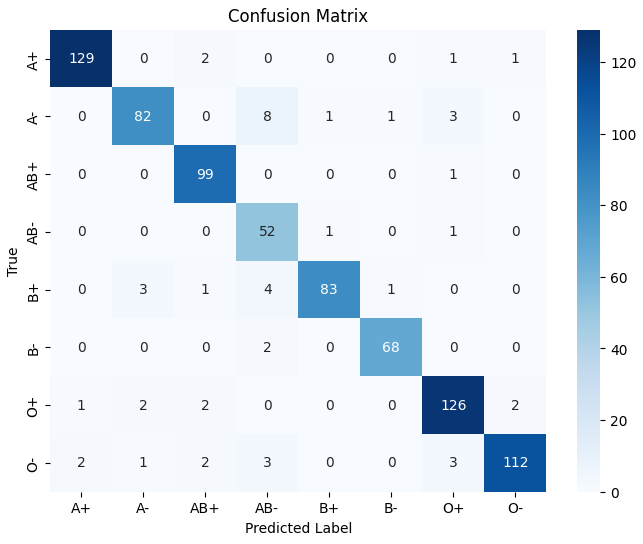
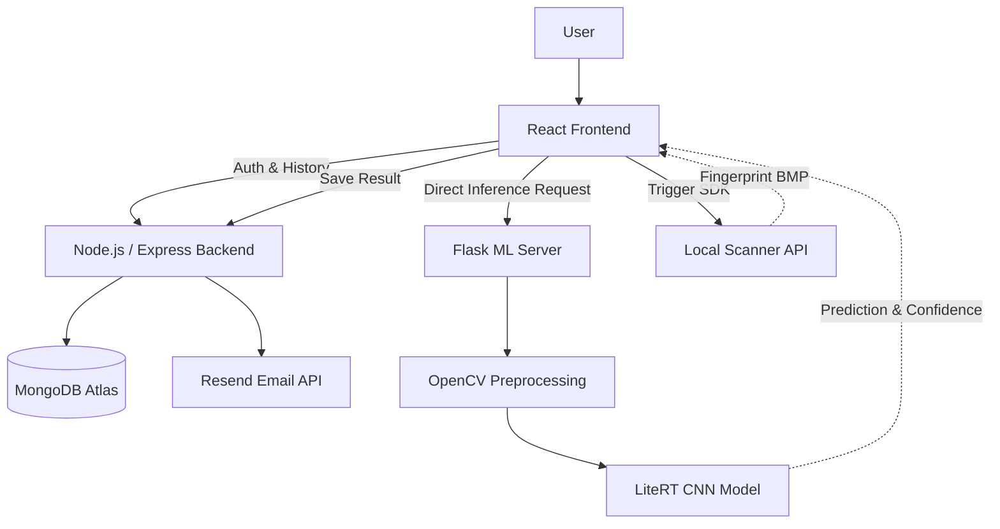

<div align="center">

# 🩸 Bindu

### A Non-Invasive Blood Group Detection System Using Fingerprint


Bindu is a pioneering, full-stack, AI-powered system designed to explore the theoretical correlation between fingerprint dermatoglyphics (ridge patterns) and human blood groups.

**🌍 Live Demo:** [https://bindu-011l.onrender.com/](https://bindu-011l.onrender.com/)

</div>

---

## 2. PROJECT OVERVIEW

Traditional blood typing requires invasive serological testing. Bindu proposes a novel, non-invasive alternative by utilizing computer vision and deep learning to predict a user's blood group purely from high-resolution fingerprint images.

This repository contains the complete full-stack architecture required to run the system:

- A reactive **React Frontend** for user interaction and hardware scanner integration.
- A secure **Node.js/Express Backend** for data management, user authentication, and maintaining prediction histories.
- An independent **Flask ML Server** utilizing a trained Convolutional Neural Network (CNN) via Google's `ai-edge-litert` to deliver blazing-fast inference without bottlenecking the main API.

_(Note: Bindu is an academic research prototype. It is not a clinically validated diagnostic device.)_

---

## 3. ✨ KEY FEATURES

- **🔐 Secure Authentication:** JWT-based user and administrator login system.
- **👤 User & Admin Dashboards:** Dedicated portals for profile management and system-wide record monitoring.
- **🖼️ Fingerprint Uploads:** Direct file upload support alongside local hardware scanner SDK integration.
- **🤖 Deep Learning Inference:** Blazing-fast blood group classification via a lightweight CNN model.
- **📷 Image Quality Assessment:** Algorithmic calculation of contrast and sharpness (Laplacian variance) via OpenCV.
- **📊 Real-time Results:** Instant display of the predicted blood group and AI confidence percentage.
- **📜 Detection History:** Persistent MongoDB storage of all past predictions for users.
- **📧 Email Notifications:** Automated HTML prediction reports dispatched via the Resend API.

---

## 4. 📊 MACHINE LEARNING RESULTS

**Model Validation Accuracy across 50 Epochs:**
<br/>


> **Highlight:** The model's validation accuracy rapidly increases and stabilizes at approximately **0.94 to 0.95** by epoch 50! This proves the AI is highly effective at distinguishing the complex dermatoglyphic (ridge) patterns associated with different blood groups, rather than just memorizing the training data.

**Confusion Matrix (800 Test Images):**
<br/>


> **Highlight:** Out of 800 test images, the model correctly predicted 751 of them.

---

## 5. 🏗️ SYSTEM ARCHITECTURE

Bindu utilizes a parallel-processing microservice architecture. The Frontend coordinates directly with the ML Server for inference, preventing heavy image processing payloads from bottlenecking the primary Node.js database server.



---

## 6. 🔄 SYSTEM WORKFLOW

1. **Capture:** The user initiates a scan via the React Frontend (uploading a file or triggering the local hardware scanner).
2. **Parallel Dispatch:** The frontend sends the image to the Node.js backend to be temporarily saved via Multer, while simultaneously sending it to the Flask ML Server.
3. **Preprocessing:** The ML Server validates the image, resizes it to 64x64, and calculates an OpenCV quality score.
4. **Inference:** The LiteRT CNN model processes the tensor and outputs an 8-class probability array.
5. **Prediction:** The Flask server returns the highest-probability blood group to the Frontend.
6. **Persistence:** The Frontend submits the final prediction, confidence score, and processing time back to the Node.js backend to be permanently appended to the user's MongoDB detection history.

---

## 7. 🧩 MONOREPO STRUCTURE

```text
Final-project-main/
├── frontend/                     # React UI Application
│   ├── src/Pages/
│   ├── src/Components/
│   └── vite.config.js
│
└── Backend/                      # Express Data API
    ├── Controllers/              # Auth, Email, Scanner logic
    ├── Models/                   # Mongoose Schemas
    ├── Routes/
    ├── uploads/                  # Local Multer storage
    │
    └── Ml_server/                # Flask Inference Service
        ├── app.py                # ML REST API
        ├── model.tflite          # Exported CNN Weights
        └── gunicorn.conf.py      # WSGI deployment config
```

| Component     | Responsibility                                     |
| ------------- | -------------------------------------------------- |
| **Frontend**  | User interface, routing, and scanner coordination. |
| **Backend**   | JWT Auth, MongoDB management, email dispatch.      |
| **ML Server** | OpenCV preprocessing and TFLite CNN inference.     |

---

## 8. 💻 TECHNOLOGY STACK

| Layer                | Technology         | Purpose                                                          |
| -------------------- | ------------------ | ---------------------------------------------------------------- |
| **Frontend**         | React 19           | Component-based user interface.                                  |
| **Frontend**         | Tailwind & DaisyUI | Rapid, responsive styling.                                       |
| **Frontend**         | Vite 6             | Ultra-fast development server and bundler.                       |
| **Backend**          | Node.js & Express  | Asynchronous REST API runtime.                                   |
| **Database**         | MongoDB & Mongoose | Flexible NoSQL document storage.                                 |
| **Backend Tools**    | JWT & bcrypt       | Secure session management and password hashing.                  |
| **Machine Learning** | Python & Flask     | High-performance inference microservice.                         |
| **Machine Learning** | ai-edge-litert     | Google's lightweight TFLite runtime (replaces heavy TensorFlow). |
| **Machine Learning** | OpenCV & Pillow    | Image processing, resizing, and quality assessment.              |

---

## 9. 🎨 FRONTEND

The Bindu frontend provides a clean, clinical, and accessible user experience. Built with React and styled via Tailwind CSS, it ensures responsive layouts across mobile and desktop devices.

| Area               | Description                                                                                             |
| ------------------ | ------------------------------------------------------------------------------------------------------- |
| **Authentication** | Secure JWT-based login and registration flows.                                                          |
| **Dashboard**      | Protected user portal to view past detection history and update profiles.                               |
| **Detection**      | Interactive interface to upload images, view real-time AI confidence scores, and request email reports. |
| **Admin**          | Dedicated portal for system administrators to view all global records and block/unblock specific users. |

---

## 10. ⚙️ BACKEND

The Node.js backend acts as the system of record and security gatekeeper.

- **Authentication:** Strict Joi payload validation, bcrypt password hashing, and JWT token issuance.
- **Authorization:** Role-based middleware ensuring only `"admin"` users can access global records.
- **File Handling:** Utilizing Multer to locally store user avatars and fingerprint scans.
- **External Services:** Automated password resets via Nodemailer (SMTP) and HTML prediction reports via the Resend API.
- **Hardware Integration:** Specialized `exec` routes to launch and monitor local fingerprint scanner SDKs.

---

## 11. 🤖 MACHINE LEARNING

The ML Server is an isolated Python microservice dedicated solely to processing fingerprint images.

```text
Fingerprint Image
       ↓
Validation (Allowed Extensions)
       ↓
Image Quality Assessment (OpenCV Contrast/Laplacian)
       ↓
Preprocessing (PIL Resize to 64x64, RGB)
       ↓
Tensor Conversion (float32 Array)
       ↓
LiteRT CNN Model
       ↓
Prediction Probabilities (Softmax Array)
       ↓
Highest Confidence Selected
```

---

## 12. 🧠 MODEL ARCHITECTURE

The core AI is a Sequential Convolutional Neural Network (CNN). Initially trained in Keras, it was exported to `.tflite` to reduce deployment size (~18MB) and increase inference speed.

- **Input:** `(64, 64, 3)` RGB image array.
- **Feature Extraction:** 4 sequential blocks of `Conv2D` (32 to 64 filters, 3x3 kernels, ReLU activation) paired with `MaxPooling2D` (2x2).
- **Reasoning:** A `Flatten` layer followed by a `Dense(64)` fully connected layer.
- **Output:** A final `Dense(8)` layer utilizing a `Softmax` activation function.

---

## 13. 📊 MODEL PERFORMANCE

Based on the research notebook (`bloodgrpclassificationfromfingerprint.ipynb`) included in the repository, the model demonstrates highly capable learning metrics:

| Metric                  |                                 Value |
| ----------------------- | ------------------------------------: |
| **Training Dataset**    |                         ~5,632 Images |
| **Test Dataset**        |                            800 Images |
| **Validation Accuracy** | **$\color{#2ea043}{\text{94.87\%}}$** |
| **Validation Loss**     |                                 0.264 |

**🗂️ Dataset Source:** The collection of fingerprint images used to train and test this model can be accessed here: [Google Drive (Dataset)](https://drive.google.com/drive/folders/19U445tuz9gHgcDrv-Qwo8CjtrVEJY62k?usp=sharing)

---

## 14. 🩸 BLOOD GROUP CLASSIFICATION

The model classifies images into 8 standardized blood groups: `A+`, `A-`, `B+`, `B-`, `AB+`, `AB-`, `O+`, `O-`.

**Selection Mechanism:**
Softmax turns the model’s raw output scores into probabilities, and the group with the highest probability becomes the final prediction.

For example, suppose the model gives these raw scores for a fingerprint:
`A+: 2.0`, `A-: 1.0`, `B+: 0.1`, `O+: 0.5`

First, we turn each score into $e^{score}$:

- $e^{2.0} \approx 7.39$
- $e^{1.0} \approx 2.72$
- $e^{0.1} \approx 1.11$
- $e^{0.5} \approx 1.65$

Add them all up to get the total denominator: `7.39 + 2.72 + 1.11 + 1.65 = 12.87`

Now, calculate the final probability for each group:

- **A+**: `7.39 / 12.87` ≈ **0.57 (57%)**
- **A-**: `2.72 / 12.87` ≈ 0.21 (21%)
- **B+**: `1.11 / 12.87` ≈ 0.09 (9%)
- **O+**: `1.65 / 12.87` ≈ 0.13 (13%)

Because **A+** has the highest probability (0.57), the model confidently predicts the blood group is A+.

---

## 15. 🔐 SECURITY

- **Stateless Sessions:** JWTs (`jsonwebtoken`) are issued upon login, removing the need for server-side session memory.
- **Password Protection:** Passwords are never stored in plain text; they are salted and hashed via `bcrypt`.
- **Route Protection:** Frontend routes check local storage state, while backend routes are protected by `authenticateToken` middleware.
- **Input Validation:** The backend uses `Joi` to strictly validate incoming JSON payloads, preventing NoSQL injection.
- **Admin Isolation:** Administrative endpoints require a secondary `requireRole("admin")` middleware check.

---

## 16. 🗄️ DATABASE

The system uses MongoDB Atlas for cloud storage, managed via Mongoose ODM.

| Entity / Model      | Purpose                                                                                                                   |
| ------------------- | ------------------------------------------------------------------------------------------------------------------------- |
| **UserModel**       | Primary collection storing user credentials, personal data, and roles.                                                    |
| **detectionSchema** | An embedded subdocument array within `UserModel` that logs every individual scan's prediction, confidence, and timestamp. |
| **AdminModel**      | A secondary, isolated collection for elevated administrative accounts.                                                    |

---

## 17. 🚀 GETTING STARTED

### Prerequisites

- Node.js (v18+)
- Python (3.10+)
- MongoDB Atlas account (or local MongoDB server)

### Clone the Repository

```bash
git clone <repository-url>
cd Final-project-main
```

### 1. Start the Frontend

```bash
cd frontend
npm install
npm run dev
```

### 2. Start the Backend API

Open a new terminal window:

```bash
cd Backend
npm install
# Create your .env file here first (see section 18)
npm start
```

### 3. Start the ML Server

Open a third terminal window:

```bash
cd Backend/Ml_server
python -m venv venv
```

Activate the virtual environment:

- **Windows:** `.\venv\Scripts\activate`
- **Linux/macOS:** `source venv/bin/activate`

```bash
pip install -r requirements.txt
python app.py
```

---

## 18. ⚙️ ENVIRONMENT VARIABLES

You must configure `.env` files in both the Frontend and Backend directories. **Never commit these files to version control.**

### `frontend/.env`

```env
VITE_API_URL=http://localhost:8080
VITE_ML_API_URL=http://localhost:5000
VITE_SCANNER_API_URL=http://localhost:8080
```

### `Backend/.env`

```env
PORT=8080
FRONTEND_URL=http://localhost:5173

MONGO_CONN=mongodb+srv://<user>:<password>@cluster.mongodb.net/bindu
JWT_SECRET=your_super_secret_random_string

EMAIL_USER=your_gmail_address
EMAIL_PASS=your_app_specific_password

RESEND_API_KEY=re_your_resend_api_key
```

_(No `.env` file is strictly required for the ML Server for local development, as it defaults to port `5000`)._

---

## 19. 🔗 API / SERVICE COMMUNICATION

```text
React Frontend
   │
   ├──► (HTTP POST) ► Flask ML Server (Returns Prediction)
   │
   └──► (HTTP POST) ► Node.js Backend (Saves Prediction to Database)
```

This decentralized approach ensures that the Node.js server is never blocked waiting for a Python inference task to complete.

---

## 21. 📈 PROJECT RESULTS

During testing on a dedicated set of 800 fingerprint images, the model achieved a **$\color{#2ea043}{\text{~94\%}}$ overall real-world accuracy** (correctly predicting 751 out of 800 samples).

As shown in the Confusion Matrix, the model demonstrated near-perfect precision for **AB+ (99%)** and incredibly high recall for **A+ (98%)** and **B+ (98%)**, proving its ability to successfully isolate the specific dermatoglyphic traits of these groups.

---

## 22. ⚠️ LIMITATIONS

- **Image Quality Dependency:** The model requires clear, unsmudged fingerprints. Poor inputs may yield confident but incorrect classifications.
- **Clinical Validity:** **This system is an academic research prototype.** The correlation between fingerprints and blood groups remains a subject of theoretical research. This software has **not** been clinically validated and must never be used for medical diagnostic purposes.

---

## 24. 🎓 ACADEMIC / PROJECT INFORMATION

| Information    | Details                                                                           |
| -------------- | --------------------------------------------------------------------------------- |
| **Project**    | Bindu: A Non-Invasive Blood Group Detection Using Fingerprint                     |
| **Type**       | Academic / Research Prototype                                                     |
| **Domain**     | Artificial Intelligence, Computer Vision, & Biometrics                            |
| **Focus**      | Fingerprint-based blood group classification                                      |
| **Conference** | Presented at the 5th International Gaziantep Scientific Research Congress, Turkey |

---

## 26. 📄 LICENSE

No license has been specified for this repository.

_(Note: This is a research prototype. The predictions generated by this ML system have not been clinically validated and must not be used as a substitute for standard medical blood typing procedures.)_
