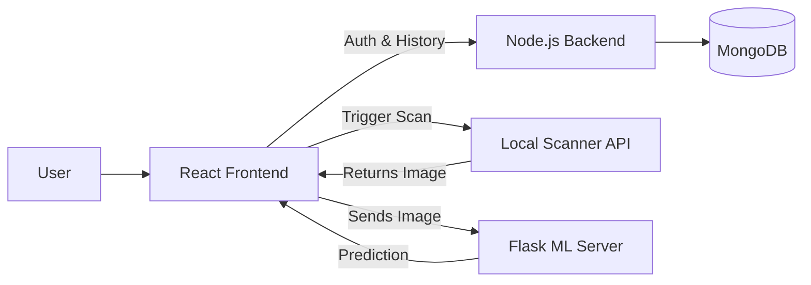

# Bindu – Frontend

> A modern web interface for AI-powered, non-invasive blood group detection using fingerprint images.

## 🌐 Project Overview

Bindu is a pioneering non-invasive blood group detection system designed to predict a user's blood group purely through fingerprint analysis. This repository houses the **Frontend** application, which serves as the primary interface for users and administrators.

The frontend provides a seamless, responsive, and intuitive experience. It securely manages user authentication, facilitates the upload and scanning of fingerprint images, and communicates with external backend services to display real-time Machine Learning prediction results and maintain historical detection records.

## ✨ Key Features

- **🔐 User Registration & Login:** Secure authentication flows with JWT token management.
- **🩸 Fingerprint-Based Detection:** Interface for uploading fingerprint images or capturing them directly via local scanner hardware integration.
- **📊 Detection Results:** Real-time display of predicted blood group, AI confidence percentage, and algorithmic image quality scores.
- **📜 Detection History:** A comprehensive log of past predictions with downloadable text reports and email notification options.
- **👨‍💼 Admin Dashboard:** Dedicated portal for administrators to monitor system-wide records, manage user roles, and enforce access control (blocking/unblocking users).
- **📱 Responsive Interface:** Fully responsive design optimized for desktops, tablets, and mobile devices.
- **🔔 Toast Notifications:** Elegant, non-intrusive alerts providing immediate feedback on user actions and system status.

## 🧩 Main Pages

| Page                                          | Description                                                                                                        |
| --------------------------------------------- | ------------------------------------------------------------------------------------------------------------------ |
| **Home** (`/`)                                | Public landing page featuring an introduction to the project, methodology articles, and system overview.           |
| **Login** (`/login`)                          | Secure entry point for returning users and administrators.                                                         |
| **Register** (`/register`)                    | Onboarding page for new users to create an account.                                                                |
| **Dashboard** (`/dashboard`)                  | Protected user portal for managing profiles, initiating fingerprint scans, and viewing personal detection history. |
| **Admin Dashboard** (`/admin-dashboard`)      | Protected portal for administrators to manage user accounts and system-wide detection data.                        |
| **Forgot Password** (`/forgot-password`)      | Recovery page for users to request password reset emails.                                                          |
| **Reset Password** (`/reset-password/:token`) | Secure page for users to establish a new password using a validated token.                                         |

## 🔄 Application Workflow

```text
User
  ↓
Register / Login
  ↓
Access Dashboard
  ↓
Upload Fingerprint Image (File or Hardware Scanner)
  ↓
Simultaneous Processing (Node.js for Storage, Flask for ML Inference)
  ↓
Blood Group Prediction Returned
  ↓
Result Displayed & Saved to Detection History
```

## 🏗️ Frontend Architecture



## 🛠️ Technology Stack

| Technology          | Purpose                                                                              |
| ------------------- | ------------------------------------------------------------------------------------ |
| **React 19**        | Core UI library for building reactive, component-based user interfaces.              |
| **Vite 6**          | Ultra-fast frontend build tool and local development server.                         |
| **JavaScript**      | Primary programming language for application logic.                                  |
| **Tailwind CSS v4** | Utility-first CSS framework for rapid, highly customizable styling.                  |
| **DaisyUI v5**      | Tailwind CSS component library providing beautiful, pre-built UI elements.           |
| **Framer Motion**   | Declarative animation library for fluid page transitions and interactive components. |
| **React Toastify**  | Elegant library for handling cross-application success and error notifications.      |

## 📁 Project Structure

```text
frontend/
├── public/                  # Static assets and icons
├── src/
│   ├── assets/              # Images, diagrams, and branding files
│   ├── Components/          # Reusable UI elements (Navbar, Footer, Modals)
│   ├── Pages/               # Top-level route components (Dashboard, Login)
│   ├── App.jsx              # Application root and landing page assembly
│   ├── main.jsx             # React initialization and routing configuration
│   ├── index.css            # Global stylesheets and Tailwind directives
│   └── utils.js             # Global utilities and fetch interceptors
├── .env                     # Environment variable configuration
├── index.html               # Main HTML entry point
├── package.json             # Project dependencies and NPM scripts
└── vite.config.js           # Vite server and build configuration
```

## 🔗 Backend & ML Integration

The frontend orchestrates communication between multiple independent services:

- **Node.js/Express Backend:** Handles all persistent data, including user authentication (JWT), profile management, and detection history logging.
- **Flask ML Server:** A dedicated microservice that receives the fingerprint image directly from the frontend, performs inference using a TFLite Convolutional Neural Network (CNN), and returns the predicted blood group.
- **Local Scanner API:** A specialized local service that interfaces with physical fingerprint scanner hardware to capture and retrieve images directly into the browser.

## 🚀 Getting Started

To run the frontend application locally for development:

1. **Install dependencies:**

   ```bash
   npm install
   ```

2. **Configure Environment Variables:**
   Create a `.env` file in the root directory and specify your backend URLs (use placeholders/local addresses below):

   ```env
   VITE_API_URL=http://localhost:5000         # Node.js Backend
   VITE_ML_API_URL=http://localhost:5001      # Flask ML Server
   VITE_SCANNER_API_URL=http://localhost:8080 # Local Hardware Scanner
   ```

3. **Start the development server:**
   ```bash
   npm run dev
   ```

## 📦 Production Build

To generate a highly optimized, minified production build:

```bash
npm run build
```

The compiled static assets will be generated inside the `dist/` directory, ready to be deployed to any static hosting provider.

## 🎨 Design

The visual identity of Bindu is clean, clinical, yet highly accessible.
By leveraging **Tailwind CSS** in conjunction with **DaisyUI**, the interface maintains strict design consistency with custom color themes. **Framer Motion** is used to introduce subtle layout animations, ensuring that transitions between the landing page, dashboards, and modal dialogs feel modern and fluid.

## 🎯 Project Purpose

Bindu serves as a proof-of-concept research prototype exploring the feasibility of non-invasive biometric analysis. The frontend acts as the critical bridge in this system, translating complex machine learning outputs and hardware integration into an accessible, user-friendly experience suitable for end-users and system administrators alike.

## 👨‍💻 Project

- **Project Name:** Bindu: A Non-Invasive Blood Group Detection Using Fingerprint
- **Project Type:** Academic/Research Prototype
- **Technologies:** React, Node.js, Flask, Machine Learning (CNN)

## 📄 License

No license is currently specified for this repository.

_(Note: This is a research prototype. The predictions generated by this ML system have not been clinically validated and must not be used as a substitute for standard medical blood typing procedures.)_
